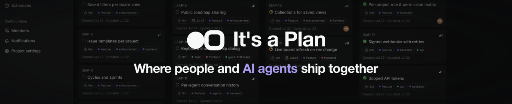
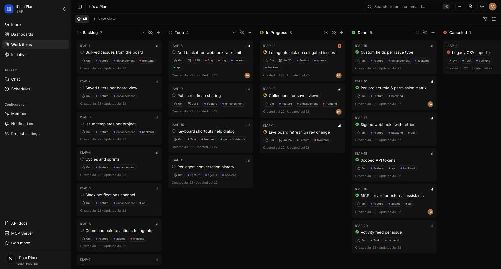

<div align="center">



### Open-source project management and issue tracking, with AI agents built in

A self-hosted, open-source alternative to Linear, Plane, and Jira for project management
and issue tracking — projects, issues, boards, and initiatives, with AI agents as
first-class members of the team. Hand work to people or agents, and let the REST API,
webhooks, and MCP do the rest.

[Website](https://itsaplan.dev) · [Discussions](https://github.com/croffasia/itsaplan/discussions) · [Contributing](CONTRIBUTING.md) · [Security](SECURITY.md)

[](LICENSE)
[](https://github.com/croffasia/itsaplan/actions/workflows/ci.yml)
[](https://github.com/croffasia/itsaplan/stargazers)
[](https://github.com/croffasia/itsaplan/commits/main)



</div>

## About

Most trackers bolt AI on as a chatbot. Here an agent is a real member of the team. It has
a role, permissions, and an assignee slot, and it works the same board your people do.

It's a self-hosted, open alternative to Linear, Plane, and Jira. You run it on your own
server and database.

- **Own your stack.** Your server, your database. No per-seat fees, no lock-in.
- **Agents as teammates.** Give an agent a model, a prompt, skills, and tools. Assign it
  issues like you would a person.
- **One board for both.** People and agents share the same board, threads, and cards.
- **Automate anything.** Drive it all through the REST API, MCP, and signed webhooks.

Heads-up: this is under active development. Expect breaking changes before the first
stable release.

## Screenshots

The work items board is shown at the top. More views to come: issue detail with an agent
reply, agent configuration, dashboards, and initiatives.

<!-- Add each new view here, 1600px wide. -->

## Features

**Tracking**

- Configure issues per project: custom fields, labels, states, and issue types
- Kanban, table, timeline, and calendar views, with configurable display fields and two-level grouping
- Save any view as a reusable template
- Configurable dashboards for project analytics: throughput, breakdown, pulse
- Custom quick actions that run on an issue
- Initiatives that group and track work across projects
- Auto-archive, a notification inbox, role-based access control, and more

**AI agents**

- Agents as project members with their own permissions and assigned issues
- Configure each agent's model, system prompt, tools, and reusable skills — built on the
  [Mastra](https://github.com/mastra-ai/mastra) agent framework
- Mention an agent in a comment to trigger a run
- Scheduled agent runs
- Built-in chat with per-agent conversation history

**Platform**

- REST API with an OpenAPI reference and API keys
- MCP server, so an external assistant can read and change issues through the same API
- Outgoing webhooks: subscribe to events, signed payloads, and retries with a delivery log
- Email and password, passkey, and Google sign-in
- Notifications by email (SMTP or Resend) and Telegram, with per-member preferences
- Instance administration: storage limits, mail transport, and instance-wide settings

## Getting started

### Local development

Requirements: [Bun](https://bun.sh) 1.3+, Docker.

```bash
bun install
cp .env.example .env
cp apps/web/.env.example apps/web/.env

docker compose -f docker-compose.dev.yml up -d   # Postgres + MinIO only
bun run db:migrate
bun run dev                                      # api + web together, via Turborepo
```

api on <http://localhost:3000>, web on <http://localhost:3001>. `bun run dev` runs the
whole workspace in watch mode from the repo root; the dev compose brings up only the
backing services and the apps run on the host.

If host port 5432 is taken, set another and update `DATABASE_URL` in `.env`:

```bash
POSTGRES_PORT=5433 docker compose -f docker-compose.dev.yml up -d
```

### Running tests

Tests run against a real test Postgres, not mocks. Prepare a dedicated `*_test`
database once, then run the suite from the repo root:

```bash
cp .env.test.example .env.test   # DATABASE_URL must name a *_test database
bun run db:migrate:test          # migrate the test database
bun run test                     # run all suites via Turborepo
```

The dev compose (`docker-compose.dev.yml`) provides Postgres and MinIO for these tests;
the attachments suite needs the MinIO bucket it creates.

Alternatively, run the same gate CI uses — the suite against a throwaway Postgres in a
container built from the production image:

```bash
docker compose -f docker-compose.test.yml up --build \
  --abort-on-container-exit --exit-code-from api-test
```

### Deploy on Coolify

Point a Docker Compose resource at `docker-compose.coolify.yml`. Coolify supplies the
secrets and domains through its own generated variables; nothing else to configure.

### Self-hosting (production)

Requirements: Docker and a domain behind a TLS-terminating reverse proxy.

```bash
git clone https://github.com/croffasia/itsaplan.git
cd itsaplan
cp .env.example .env
# Set the public origins: API_URL, APP_URL
# Generate each secret with `openssl rand -base64 32`:
#   POSTGRES_PASSWORD, BETTER_AUTH_SECRET, APP_ENCRYPTION_KEY,
#   WORKER_INTERNAL_TOKEN, S3_ACCESS_KEY_ID, S3_SECRET_ACCESS_KEY

docker compose up -d --build
```

One command brings up the whole stack: Postgres, MinIO, api, worker, bot, and web. Every
service is built from this checkout; web bakes `API_URL` into its bundle because Next.js
inlines `NEXT_PUBLIC_*` at build time. The API applies migrations on startup, and the
first account registered becomes the instance admin.

After an update, rebuild: `git pull` then `docker compose up -d --build`.

[CONTRIBUTING.md](CONTRIBUTING.md) covers the commands, the layout, and the conventions.

## Built with

| Layer     | Technology                                               |
| --------- | -------------------------------------------------------- |
| Runtime   | [Bun](https://bun.sh) + [Turborepo](https://turbo.build) |
| Backend   | [Elysia](https://elysiajs.com/)                          |
| Frontend  | [Next.js](https://nextjs.org/) App Router, SSR           |
| UI        | [shadcn/ui](https://ui.shadcn.com/) + Tailwind v4        |
| Auth      | [better-auth](https://better-auth.com/)                  |
| Database  | [Drizzle](https://orm.drizzle.team/) + PostgreSQL        |
| Storage   | S3-compatible object store (MinIO)                       |
| AI agents | [Mastra](https://github.com/mastra-ai/mastra)            |

```
apps/api        Elysia HTTP API, mounts better-auth at /api/auth/*
apps/web        Next.js app, server-side rendered
apps/worker     webhooks, notifications, agent runs
apps/bot        Telegram bot
packages/db     Drizzle client, schema, migrations
packages/auth   better-auth server instance
packages/crypto AES-256-GCM encryption for secrets at rest
packages/mailer SMTP and Resend transport
```

The web app never imports the packages directly, it talks to the API over HTTP.

## Contributing

Issues and pull requests are welcome — bug fixes, features, docs, all of it. Start with
[CONTRIBUTING.md](CONTRIBUTING.md). It covers the setup, the conventions, and how a change
gets merged. Be kind; we follow a [Code of Conduct](CODE_OF_CONDUCT.md).

## Security

Found a vulnerability? Report it privately through
[GitHub Security Advisories](https://github.com/croffasia/itsaplan/security/advisories/new),
not a public issue, so we can fix it first. Details in [SECURITY.md](SECURITY.md).

## License

Copyright © 2026 VIBE DEV SPACE LLC.

[AGPL-3.0](LICENSE). Running a modified version as a network service means publishing
your changes under the same license.
