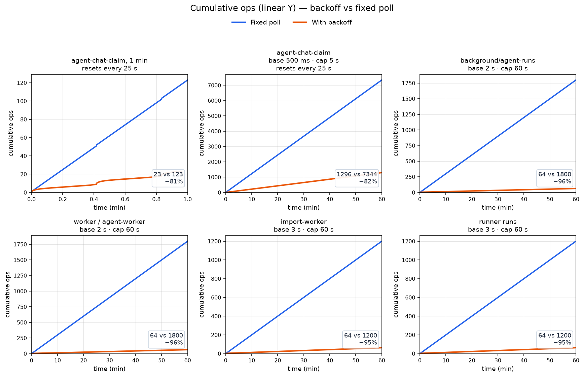
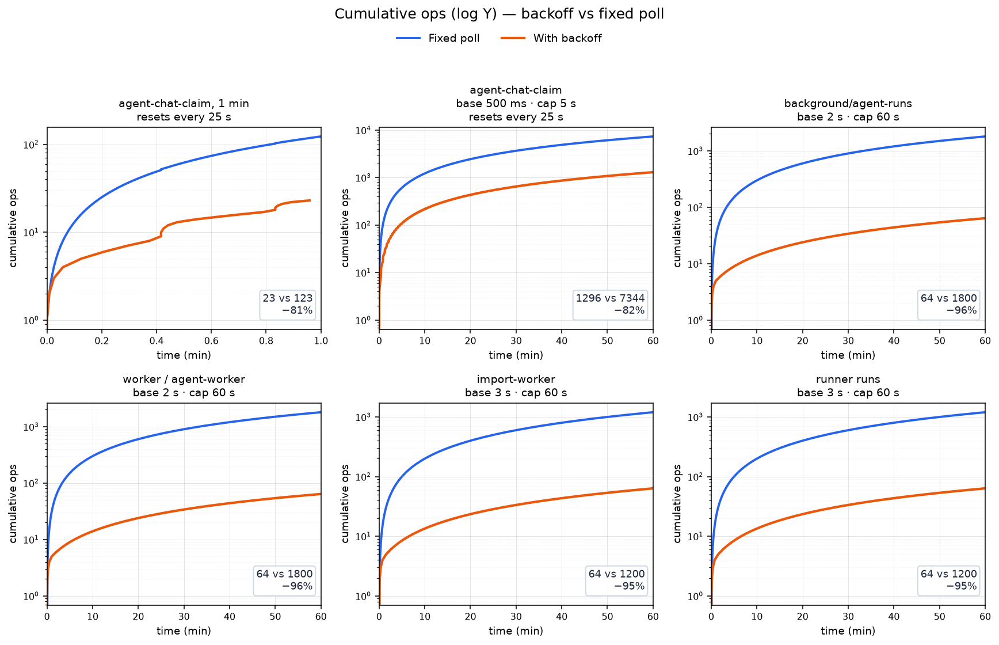

# Idle poll tuning

Quiet hours used to mean a fixed poll every 0.5–3 s on empty queues (database
checks and, for an external runner, HTTP claims). Those waits now double after
consecutive empty results, up to a cap, and reset when work appears.

Why this exists, how it is wired, lease startup guards, and how the charts below
were produced: [`docs/dev/idle-poll.md`](../dev/idle-poll.md).

## Defaults

| Loop | Process | Base | Cap | Env |
| ---- | ------- | ---- | --- | --- |
| Chat claim (inside one long-poll) | api | 500 ms | 5 s | `AGENT_CHAT_CLAIM_POLL_MS` / `AGENT_CHAT_CLAIM_POLL_MAX_MS` |
| Agent runs (internal queue) | api | 2 s | 60 s | `AGENT_RUN_POLL_INTERVAL_MS` / `AGENT_RUN_POLL_INTERVAL_MAX_MS` |
| Agent schedules | worker | 2 s | 60 s | same `AGENT_RUN_POLL_*` pair |
| Webhook delivery | worker | 2 s | 60 s | `WEBHOOK_POLL_INTERVAL_MS` / `WEBHOOK_POLL_INTERVAL_MAX_MS` |
| Import jobs | worker | 3 s | 60 s | `IMPORT_POLL_INTERVAL_MS` / `IMPORT_POLL_INTERVAL_MAX_MS` |
| External runner runs | `@itsaplan/runner` | 3 s | 60 s | `ITSAPLAN_POLL_INTERVAL_MS` / `ITSAPLAN_POLL_INTERVAL_MAX_MS` (or `pollIntervalMs` / `pollIntervalMaxMs` in the runner config) |

All pairs are optional; omitting them keeps the defaults. A base already above its
cap is left as set. `IDLE_POLL_DEBUG=1` logs each empty wait.

Lease seconds must outlast the matching timeout (and the runner's 60 s heartbeat
where it applies), or the api / worker refuse to start — see `.env.example` and
the [developer notes](../dev/idle-poll.md).

## Idle cost over one hour

Blue is the old fixed interval; orange is backoff. The first panel is the chat claim
over 1 minute, so each 25 s reset is on the axis. The next panel is that same
loop over the full hour.

| Loop | Ops with backoff | Ops fixed | Reduction |
| ---- | ---------------: | --------: | --------: |
| agent-chat-claim | 1 296 | 7 344 | −82 % |
| background/agent-runs | 64 | 1 800 | −96 % |
| worker / agent-worker | 64 | 1 800 | −96 % |
| import-worker | 64 | 1 200 | −95 % |
| runner runs | 64 | 1 200 | −95 % |

Quiet-hour floor only; busy periods reset to the base. Chat is counted inside each
25 s claim (`AGENT_CHAT_CLAIM_WAIT_MS`): the streak starts again on the next claim,
so the 5 s cap is not held for the whole hour. The fixed column for chat is a look
every 500 ms inside that same window. These are simulated counts, with the next
claim starting as soon as the previous one ends.

## Tuning

- Raise the `*_MAX_*` cap to spend fewer idle checks (pickup after a long quiet
  stretch is a little slower).
- Lower the base if you need snappier pickup when work is frequent.
- Chat uses the most aggressive base (500 ms) with a 5 s cap so answers still
  feel near-live after a short idle gap.
- To turn backoff off (fixed interval, e.g. local develop), set each loop’s max
  equal to its base (`AGENT_CHAT_CLAIM_POLL_MAX_MS=500` with poll `500`,
  `AGENT_RUN_POLL_INTERVAL_MAX_MS=2000` with interval `2000`, and the same idea
  for webhook / import / runner). There is no separate master switch.
